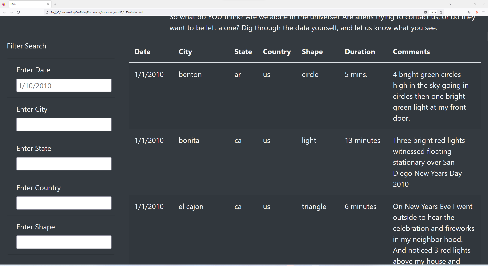
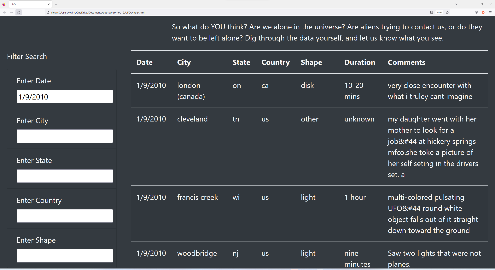
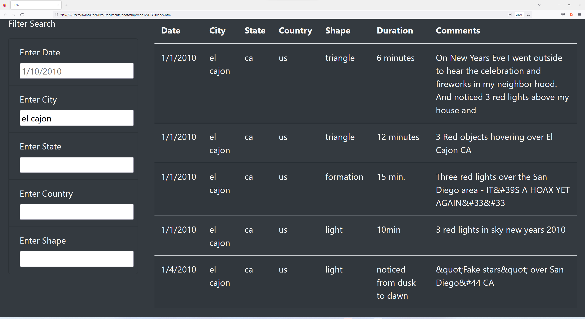
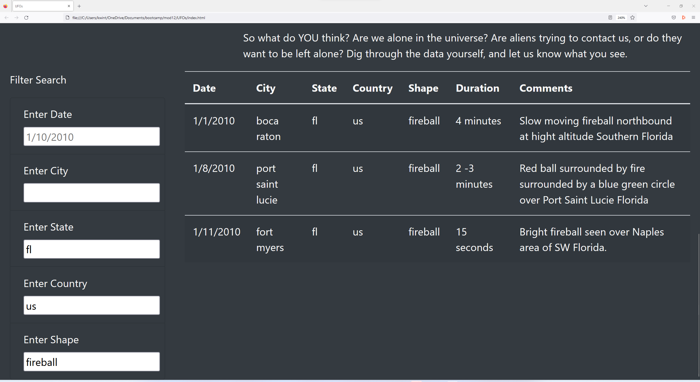

# UFOs

## Overview of Project

The purpose of this project is to design a Web page that allows the user to filter a table of Unidentified Flying Object (UFO) sighting reports based on various filter criteria.

## Results

The user may filter the data table by entering search criteria into the corresponding input field for each filter and then clicking away from all input fields.

As shown below, we can filter based on the date of a sighting:

We can filter based on city to get all sightings in cities with the name El Cajon:

Finally, we can apply muiltiple filters to get all UFO sightings in Florida, United States with the "fireball" shape:

## Summary

One drawback of this design is that it is currently not possible to save a filter query. A way to address this issue would be to implement a feature that allows the user to save filter queries. Another feature that one could implement is support for filter searches based on approximate text rather than exact text.

